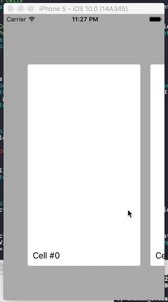

# iOS-Carousel
An programatic example of the carousel effect with *paging*. Used in upcoming app **Trvlnply**.

# Implementation explanation:
This is a regular `UICollectionView` with a custom `UICollectionViewFlowLayout` that overrides the obscure method `targetContentOffsetForProposedContentOffset` to allow the `UICollectionView` to page and always center each cell.

Check out the Implementation for details.

# Goals for this project:
* Turn into a framework (later a Carth/Cocoapods)
* Orientation support
